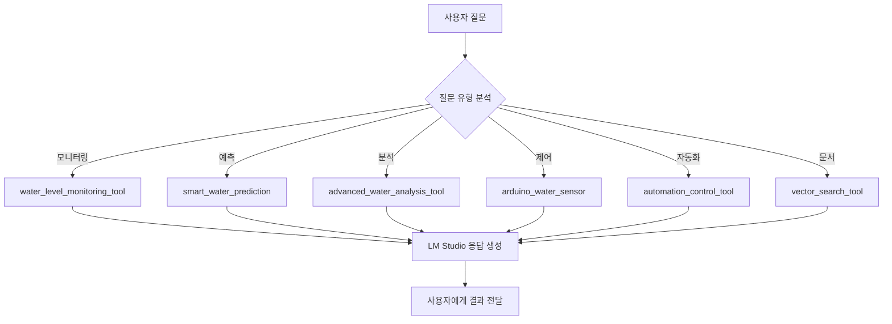

# 🛠️ Agentic RAG 시스템 도구 완전 가이드

## 📋 목차
- [시스템 개요](#시스템-개요)
- [도구 카테고리별 분류](#도구-카테고리별-분류)
- [도구 상세 설명](#도구-상세-설명)
- [테스트 시나리오](#테스트-시나리오)
- [통합 워크플로우](#통합-워크플로우)
- [트러블슈팅](#트러블슈팅)

---

## 시스템 개요

이 시스템은 **배수지 수위 모니터링 및 자동화 관리**를 위한 Agentic RAG 시스템입니다.

### 핵심 기능
- 실시간 수위 모니터링 (아두이노 센서 연동)
- AI 기반 수위 예측 (LSTM 딥러닝)
- 자동화된 펌프 제어
- 문서 기반 RAG 검색
- 고급 데이터 분석 및 의사결정

### 기술 스택
- **AI/ML**: LM Studio (로컬 LLM), LSTM 예측 모델
- **Database**: PostgreSQL (pgvector)
- **Hardware**: Arduino (USB 시리얼 통신)
- **Frontend**: Streamlit
- **Backend**: Python, Docker

---

## 도구 카테고리별 분류

### 🤖 **자동화 시스템** (1개)
| 도구 | 파일 | 주요 역할 |
|------|------|----------|
| automation_control_tool | automation_control_tool.py | AI 자동화 중앙 제어 허브 |

### 📈 **수위 예측** (2개)
| 도구 | 파일 | 주요 역할 |
|------|------|----------|
| smart_water_prediction | smart_water_prediction_tool.py | DB 자동 연동 예측 (추천) |
| water_level_prediction_tool | water_level_prediction_tool.py | 수동 데이터 입력 예측 |

### 📊 **데이터 조회/분석** (2개)
| 도구 | 파일 | 주요 역할 |
|------|------|----------|
| water_level_monitoring_tool | water_level_monitoring_tool.py | 현재 상태, 그래프, 이력 조회 |
| advanced_water_analysis_tool | advanced_water_analysis_tool.py | 추세 분석, 경보 예측, 비교 |

### ⚙️ **하드웨어 제어** (2개)
| 도구 | 파일 | 주요 역할 |
|------|------|----------|
| arduino_water_sensor | arduino_water_sensor_tool.py | 센서 읽기, 펌프 제어 |
| real_time_database_control_tool | real_time_database_control_tool.py | 실시간 데이터 수집 서비스 |

### 📚 **문서 관리** (2개)
| 도구 | 파일 | 주요 역할 |
|------|------|----------|
| vector_search_tool | vector_search_tool.py | 벡터 기반 문서 검색 |
| list_files_tool | list_files_tool.py | 업로드 파일 목록 조회 |

---

## 도구 상세 설명

### 🤖 1. automation_control_tool

**파일**: `tools/automation_control_tool.py`

**역할**: AI 자동화 에이전트의 중앙 제어 허브

**핵심 기능**:
- 자율 모니터링 시작/중지
- 시스템 상태 조회 (상세 리포트)
- Arduino 연결 디버깅
- 의사결정 로그 조회

**지원 액션**:
```python
actions = [
    "start",                    # 자동화 시작
    "stop",                     # 자동화 중지
    "status",                   # 상태 조회 (detailed_report 포함)
    "debug_arduino",            # Arduino 디버깅 정보
    "test_arduino_connection",  # Arduino 연결 테스트
    "get_logs"                  # 로그 조회 (레벨 필터링)
]
```

**파라미터**:
- `action` (필수): 실행할 액션
- `limit` (선택): 로그 조회 시 개수 (기본값: 50)
- `level` (선택): 로그 레벨 필터 (DEBUG, INFO, WARNING, ERROR, CRITICAL)
- `reservoir_id` (선택): 특정 배수지 로그만 조회

**응답 구조**:
```json
{
    "success": true,
    "message": "AI 자동화 에이전트가 시작되었습니다",
    "detailed_report": "마크다운 형식의 상세 리포트",
    "formatted_status": {
        "automation_active": true,
        "monitoring_interval": 60,
        "arduino_connected": true,
        "last_check_time": "2025-10-14 15:30:00"
    }
}
```

**테스트 시나리오**:
```
사용자: "자동화 시작해줘"
→ automation_control_tool(action="start")

사용자: "시스템 상태 보여줘"
→ automation_control_tool(action="status")

사용자: "최근 로그 50개 보여줘"
→ automation_control_tool(action="get_logs", limit=50)

사용자: "Arduino 연결 확인"
→ automation_control_tool(action="debug_arduino")
```

---

### 📈 2. smart_water_prediction ⭐

**파일**: `tools/smart_water_prediction_tool.py`

**역할**: 데이터베이스 자동 연동 스마트 수위 예측 (추천 도구)

**핵심 기능**:
- 자동으로 DB에서 과거 수위 데이터 조회
- 하이브리드 모델(선형 회귀 + 이동 평균)로 미래 수위 예측
- 가곡/해룡 배수지 지원

**지원 배수지**:
- `gagok` / `가곡`: 가곡 배수지
- `haeryong` / `해룡`: 해룡 배수지

**파라미터**:
- `reservoir` (필수): 배수지 이름 (gagok, haeryong, 가곡, 해룡)
- `time_minutes` (필수): 예측 시간 (분 단위) - 1, 5, 30, 60, 360 등
- `lookback_hours` (선택): 과거 데이터 조회 시간 (기본값: 24시간)

**응답 구조**:
```json
{
    "success": true,
    "reservoir": "가곡",
    "current_level": 75.3,
    "predicted_level": 76.8,
    "change": 1.5,
    "prediction_time": "2025-10-14 16:00:00",
    "time_minutes": 30,
    "trend": "상승",
    "confidence": 0.92,
    "data_points_used": 144,
    "prediction_summary": "가곡 배수지 30분 후 예상 수위: 76.80%"
}
```

**테스트 시나리오**:
```
사용자: "가곡 배수지 30분 후 수위 예측해줘"
→ smart_water_prediction(reservoir="가곡", time_minutes=30)

사용자: "해룡 1시간 뒤 수위는?"
→ smart_water_prediction(reservoir="해룡", time_minutes=60)

사용자: "가곡 6시간 후 예상 수위"
→ smart_water_prediction(reservoir="가곡", time_minutes=360)

사용자: "해룡 5분 후 수위 알려줘"
→ smart_water_prediction(reservoir="해룡", time_minutes=5)
```

---

### 📈 3. water_level_prediction_tool

**파일**: `tools/water_level_prediction_tool.py`

**역할**: 수동 데이터 입력 기반 LSTM 수위 예측

**핵심 기능**:
- 사용자가 직접 제공한 수위 데이터로 예측
- DB 자동 조회 없음
- 유연한 파라미터 처리 (water_levels, dataPoints, data 모두 허용)

**파라미터**:
- `water_levels` / `dataPoints` / `data` (필수 중 하나): 과거 수위 배열
- `prediction_steps` / `prediction_hours` / `time_horizon` (선택): 예측 시점 개수

**응답 구조**:
```json
{
    "success": true,
    "predictions": [76.5, 77.2, 77.8],
    "input_data": [70.5, 71.2, 72.1, 70.8],
    "prediction_steps": 3,
    "model": "LSTM"
}
```

**테스트 시나리오**:
```
사용자: "[70.5, 71.2, 72.1, 70.8] 데이터로 미래 수위 3시간 예측해줘"
→ water_level_prediction_tool(
    water_levels=[70.5, 71.2, 72.1, 70.8],
    prediction_steps=3
)

사용자: "12.1, 24.5, 12.1 이 데이터로 1시간 후 예측"
→ water_level_prediction_tool(
    data=[12.1, 24.5, 12.1],
    prediction_hours=1
)
```

**주의사항**:
- 배수지 이름만 있고 데이터가 없으면 이 도구 대신 `smart_water_prediction` 사용 권장

---

### 📊 4. water_level_monitoring_tool

**파일**: `tools/water_level_monitoring_tool.py`

**역할**: 배수지 수위 모니터링 및 시각화

**핵심 기능**:
- 가곡/해룡/상사 배수지 실시간 상태 조회
- 과거 데이터 조회 (measured_at 기준)
- 그래프 생성 (matplotlib)
- 테스트 데이터 추가

**지원 액션**:
```python
actions = [
    "current_status",    # 현재 상태 조회
    "historical_data",   # 과거 데이터 조회
    "generate_graph",    # 그래프 생성 (base64 인코딩)
    "add_sample_data"    # 테스트 데이터 추가
]
```

**파라미터**:
- `action` (필수): 실행할 액션
- `hours` (선택): 조회 시간 범위 (기본값: 24시간, 최대: 168시간)

**응답 구조 (current_status)**:
```json
{
    "success": true,
    "timestamp": "2025-10-14T15:30:00.123456",
    "reservoirs": [
        {
            "reservoir": "가곡 배수지",
            "reservoir_id": "gagok",
            "current_level": 75.3,
            "pump_statuses": {
                "pump_a": false,
                "pump_b": false
            },
            "active_pumps": 0,
            "total_pumps": 2,
            "status": "NORMAL",
            "last_update": "2025-10-14T15:30:00"
        }
    ],
    "total_reservoirs": 3
}
```

**응답 구조 (generate_graph)**:
```json
{
    "success": true,
    "graph_file_id": "graph_20251014_153100",
    "graph_filename": "water_levels_20251014_153100.png",
    "image_base64": "iVBORw0KGgoAAAANSUhEUg...",
    "time_range_hours": 24,
    "time_range_display": "2025-10-13 15:31:00 ~ 2025-10-14 15:31:00",
    "reservoirs_count": 3,
    "data_points": 48,
    "message": "3개 배수지의 24시간 수위 그래프 생성 완료\n시간 범위: 2025-10-13 15:31:00 ~ 2025-10-14 15:31:00"
}
```

**테스트 시나리오**:
```
사용자: "수위 현황 보여줘"
→ water_level_monitoring_tool(action="current_status")

사용자: "지난 12시간 수위 데이터 조회"
→ water_level_monitoring_tool(action="historical_data", hours=12)

사용자: "24시간 수위 변화 그래프 그려줘"
→ water_level_monitoring_tool(action="generate_graph", hours=24)

사용자: "테스트 데이터 추가해줘"
→ water_level_monitoring_tool(action="add_sample_data")
```

**그래프 기능**:
- 배수지별 수위 변화 시계열 그래프
- PNG 이미지로 변환 후 base64 인코딩
- 한글 폰트 지원 (Malgun Gothic)

---

### 📊 5. advanced_water_analysis_tool

**파일**: `tools/advanced_water_analysis_tool.py`

**역할**: 고급 수위 분석 및 의사결정 지원

**핵심 기능**:
- 수위 추세 분석 (상승/하강 속도, 가속도)
- 경보 시점 예측 (임계값 도달 시간)
- 펌프 효과 시뮬레이션 (What-if 분석)
- 기간별 비교 (오전 vs 오후, 지난주 vs 이번주)
- 펌프 이력 조회
- 자연어 시간 표현 해석 ("어제", "점심때", "지난 3시간")

**지원 액션**:
```python
actions = [
    "current_trend",      # 추세 분석 (속도, 가속도)
    "predict_alert",      # 경보 시점 예측
    "simulate_pump",      # 펌프 효과 시뮬레이션
    "compare_periods",    # 기간별 비교
    "pump_history",       # 펌프 이력
    "parse_time"          # 시간 표현 해석
]
```

**파라미터**:
- `action` (필수): 실행할 액션
- `reservoir_id` (선택): 배수지 (gagok, haeryong, sangsa, 기본값: gagok)
- `hours` (선택): 분석 시간 범위 (기본값: 1시간)
- `alert_threshold` (선택): 경보 수위 임계값 (기본값: 100cm)
- `pump_flow_rate` (선택): 펌프 유량 (기본값: 10 cm/hour)
- `period1_start`, `period1_end`: 첫 번째 비교 기간
- `period2_start`, `period2_end`: 두 번째 비교 기간
- `expression`: 파싱할 자연어 시간 표현

**응답 구조 (current_trend)**:
```json
{
    "success": true,
    "action": "current_trend",
    "reservoir": "가곡 배수지",
    "trend": {
        "direction": "상승",
        "rate": 1.5,
        "rate_unit": "cm/hour",
        "acceleration": 0.2,
        "current_level": 75.3,
        "1hour_ago": 73.8,
        "prediction_1hour": 76.8
    }
}
```

**응답 구조 (predict_alert)**:
```json
{
    "success": true,
    "action": "predict_alert",
    "reservoir": "가곡 배수지",
    "alert_prediction": {
        "current_level": 75.3,
        "threshold": 100.0,
        "estimated_time": "2025-10-14T21:30:00",
        "hours_until_alert": 6.5,
        "will_reach_threshold": true
    }
}
```

**테스트 시나리오**:
```
사용자: "현재 수위 상승 속도는?"
→ advanced_water_analysis_tool(
    action="current_trend",
    reservoir_id="gagok",
    hours=1
)

사용자: "가곡 배수지 언제 100cm 도달할까?"
→ advanced_water_analysis_tool(
    action="predict_alert",
    reservoir_id="gagok",
    alert_threshold=100
)

사용자: "펌프 켜면 얼마나 빨리 떨어질까?"
→ advanced_water_analysis_tool(
    action="simulate_pump",
    reservoir_id="gagok",
    pump_flow_rate=15
)

사용자: "오전과 오후 수위 비교"
→ advanced_water_analysis_tool(
    action="compare_periods",
    reservoir_id="gagok"
)
→ 자동으로 오전(00:00-12:00), 오후(12:00-23:59) 비교

사용자: "어제 펌프 돌았나?"
→ advanced_water_analysis_tool(
    action="pump_history",
    reservoir_id="gagok",
    hours=24
)
```

**자연어 시간 파싱**:
- "어제" → 어제 날짜
- "오늘", "내일"
- "점심", "12시" → 12:00
- "오전", "아침" → 09:00
- "오후" → 15:00
- "저녁" → 18:00
- "지난 3시간" → 3시간 전부터 현재까지

---

### ⚙️ 6. arduino_water_sensor

**파일**: `tools/arduino_water_sensor_tool.py`

**역할**: 아두이노 하드웨어 제어 (USB 시리얼 통신)

**핵심 기능**:
- 실시간 수위 센서 값 읽기 (8채널 지원)
- 펌프1, 펌프2 개별 제어
- 자동 포트 감지 (WSL2, Linux, Windows 지원)
- 시뮬레이션 모드 (하드웨어 없이 테스트)

**지원 액션**:
```python
actions = [
    "read_water_level",           # 모든 센서 읽기
    "read_water_level_channel",   # 특정 채널 읽기
    "read_current_level",         # 현재 수위 읽기
    "pump1_on",                   # 펌프1 켜기
    "pump1_off",                  # 펌프1 끄기
    "pump2_on",                   # 펌프2 켜기
    "pump2_off",                  # 펌프2 끄기
    "connect",                    # 연결
    "disconnect",                 # 연결 해제
    "status",                     # 상태 확인
    "test_communication",         # 통신 테스트
    "pump_status",                # 펌프 상태 확인
    "read_pump_status"            # 펌프 상태 읽기
]
```

**파라미터**:
- `action` (필수): 실행할 액션
- `channel` (선택): 센서 채널 번호 (0-7)
- `port` (선택): 시리얼 포트 (자동 감지 가능)
- `duration` (선택): 펌프 작동 시간 (초, 1-300)

**응답 구조**:
```json
{
    "success": true,
    "action": "read_water_level",
    "data": {
        "channel_0": 75.3,
        "channel_1": 76.8,
        "channel_2": null,
        "timestamp": "2025-10-14T15:30:00"
    },
    "port": "/dev/ttyACM0",
    "simulation_mode": false
}
```

**테스트 시나리오**:
```
사용자: "현재 수위 알려줘"
→ arduino_water_sensor(action="read_water_level")

사용자: "펌프1 켜줘"
→ arduino_water_sensor(action="pump1_on")

사용자: "펌프1 10초 동안 켜줘"
→ arduino_water_sensor(action="pump1_on", duration=10)

사용자: "펌프 상태 확인"
→ arduino_water_sensor(action="pump_status")

사용자: "아두이노 연결해줘"
→ arduino_water_sensor(action="connect")

사용자: "센서 채널 2번 읽어줘"
→ arduino_water_sensor(action="read_water_level_channel", channel=2)
```

**환경 변수 설정** (.env):
```bash
ARDUINO_SERIAL_PORT="/dev/ttyACM0"  # 또는 COM3 (Windows)
```

**WSL2 설정**:
```bash
# Windows에서 usbipd-win 설치 후
usbipd wsl list
usbipd wsl attach --busid 1-1
```

---

### ⚙️ 7. real_time_database_control_tool

**파일**: `tools/real_time_database_control_tool.py`

**역할**: 실시간 데이터 수집 서비스 제어

**핵심 기능**:
- 아두이노에서 자동으로 데이터 수집
- PostgreSQL water 테이블에 실시간 저장
- 시뮬레이션 모드 지원
- 수집 간격 설정 가능

**지원 액션**:
```python
actions = [
    "start",           # 서비스 시작
    "stop",            # 서비스 중단
    "status",          # 상태 조회
    "manual_collect",  # 수동 1회 수집
    "restart"          # 서비스 재시작
]
```

**파라미터**:
- `action` (필수): 실행할 액션
- `update_interval` (선택): 수집 간격 (초, 기본값: 60초, 범위: 10-3600)

**응답 구조**:
```json
{
    "success": true,
    "action": "start",
    "message": "실시간 데이터 수집 서비스가 시작되었습니다",
    "service_status": {
        "running": true,
        "interval": 60,
        "last_update": "2025-10-14T15:30:00",
        "total_collections": 142,
        "simulation_mode": false
    }
}
```

**테스트 시나리오**:
```
사용자: "실시간 데이터 수집 시작해줘"
→ real_time_database_control_tool(action="start")

사용자: "30초마다 데이터 수집하도록 설정"
→ real_time_database_control_tool(action="start", update_interval=30)

사용자: "데이터 수집 중단해줘"
→ real_time_database_control_tool(action="stop")

사용자: "실시간 서비스 상태 확인"
→ real_time_database_control_tool(action="status")

사용자: "지금 데이터 한번 수집해줘"
→ real_time_database_control_tool(action="manual_collect")

사용자: "서비스 재시작"
→ real_time_database_control_tool(action="restart")
```

**데이터베이스 연동**:
```sql
-- water 테이블 구조
CREATE TABLE water (
    id SERIAL PRIMARY KEY,
    measured_at TIMESTAMP DEFAULT NOW(),
    gagok_water_level REAL,
    haeryong_water_level REAL,
    sangsa_water_level REAL,
    gagok_pump_a BOOLEAN DEFAULT FALSE,
    haeryong_pump_a BOOLEAN DEFAULT FALSE
);
```

---

### 📚 8. vector_search_tool

**파일**: `tools/vector_search_tool.py`

**역할**: 벡터 기반 문서 검색 (RAG)

**핵심 기능**:
- 업로드된 PDF, 텍스트 파일에서 의미 기반 검색
- pgvector를 활용한 임베딩 유사도 검색
- 파일명, 태그 필터링
- 검색 모드 선택 (vector, context, auto)

**파라미터**:
- `query` (필수): 검색 질의문
- `file_filter` (선택): 특정 파일 이름 필터
- `tags_filter` (선택): 태그 배열로 필터링
- `top_k` (선택): 반환할 최대 결과 개수 (기본값: 5)
- `mode` (선택): 검색 모드 (auto, vector, context)

**검색 모드**:
- `vector`: 임베딩 유사도 검색 (의미 기반)
- `context`: 키워드 검색 (전통적 검색)
- `auto`: 자동 선택 (기본값)

**응답 구조**:
```json
{
    "success": true,
    "results": [
        {
            "content": "배수지 관리 지침서...",
            "file_name": "manual.pdf",
            "similarity": 0.92,
            "page": 5,
            "tags": ["매뉴얼", "관리"]
        }
    ],
    "query": "배수지 관리 방법",
    "total_results": 5
}
```

**테스트 시나리오**:
```
사용자: "배수지 관리 방법 알려줘"
→ vector_search_tool(query="배수지 관리 방법")

사용자: "매뉴얼에서 펌프 설명 찾아줘"
→ vector_search_tool(
    query="펌프 설명",
    file_filter="manual.pdf"
)

사용자: "최근 보고서 10개 검색"
→ vector_search_tool(
    query="보고서",
    top_k=10,
    tags_filter=["report"]
)
```

**임베딩 모델** (.env):
```bash
EMBEDDING_BACKEND=HF
EMBEDDING_MODEL_NAME=dragonkue/BGE-m3-ko
EMBEDDING_DEVICE=cpu
```

---

### 📚 9. list_files_tool

**파일**: `tools/list_files_tool.py`

**역할**: 업로드된 파일 목록 조회

**핵심 기능**:
- PostgreSQL에 저장된 파일 메타데이터 조회
- 파일명, 크기, 업로드 시간, 태그 표시

**파라미터**: 없음

**응답 구조**:
```json
{
    "success": true,
    "files": [
        {
            "id": 1,
            "filename": "manual.pdf",
            "size_mb": 2.5,
            "upload_date": "2025-10-14T10:00:00",
            "tags": ["매뉴얼", "관리"],
            "chunk_count": 45
        }
    ],
    "total_files": 1
}
```

**테스트 시나리오**:
```
사용자: "업로드된 파일 목록 보여줘"
→ list_files_tool()

사용자: "어떤 파일들이 있어?"
→ list_files_tool()
```

---

## 테스트 시나리오

### 🎯 시나리오 1: 기본 모니터링 워크플로우

```
1. 사용자: "시스템 상태 확인"
   → automation_control_tool(action="status")

2. 사용자: "현재 수위 보여줘"
   → water_level_monitoring_tool(action="current_status")

3. 사용자: "24시간 수위 그래프 그려줘"
   → water_level_monitoring_tool(action="generate_graph", hours=24)
```

**예상 결과**:
- 시스템 전체 상태 리포트
- 가곡/해룡/상사 배수지 현재 수위
- 24시간 수위 변화 그래프 (base64 이미지)

---

### 🎯 시나리오 2: 수위 예측 및 경보

```
1. 사용자: "가곡 배수지 30분 후 수위 예측해줘"
   → smart_water_prediction(reservoir="가곡", time_minutes=30)

2. 사용자: "현재 수위 상승 속도는?"
   → advanced_water_analysis_tool(action="current_trend", reservoir_id="gagok")

3. 사용자: "언제 100cm 도달할까?"
   → advanced_water_analysis_tool(
       action="predict_alert",
       reservoir_id="gagok",
       alert_threshold=100
   )
```

**예상 결과**:
- 30분 후 예상 수위: 76.8cm (현재 75.3cm)
- 상승 속도: 1.5 cm/hour
- 경보 도달 예상 시간: 2025-10-14 21:30 (약 6.5시간 후)

---

### 🎯 시나리오 3: 자동화 시작 및 펌프 제어

```
1. 사용자: "자동화 시작해줘"
   → automation_control_tool(action="start")

2. 사용자: "실시간 데이터 수집 시작"
   → real_time_database_control_tool(action="start", update_interval=60)

3. 수위가 임계값 초과 시 AI가 자동으로:
   → arduino_water_sensor(action="pump1_on", duration=30)

4. 사용자: "펌프 상태 확인"
   → arduino_water_sensor(action="pump_status")
```

**예상 결과**:
- AI 자동화 에이전트 활성화
- 60초마다 수위 데이터 자동 수집
- 임계값 초과 시 펌프 자동 작동
- 펌프 상태: pump1=ON, pump2=OFF

---

### 🎯 시나리오 4: 고급 분석 및 의사결정

```
1. 사용자: "오전과 오후 수위 비교"
   → advanced_water_analysis_tool(action="compare_periods", reservoir_id="gagok")

2. 사용자: "펌프 켜면 얼마나 빨리 떨어질까?"
   → advanced_water_analysis_tool(
       action="simulate_pump",
       reservoir_id="gagok",
       pump_flow_rate=15
   )

3. 사용자: "어제 펌프 돌았나?"
   → advanced_water_analysis_tool(
       action="pump_history",
       reservoir_id="gagok",
       hours=24
   )
```

**예상 결과**:
- 오전 평균: 73.5cm, 오후 평균: 76.2cm (2.7cm 차이)
- 펌프 작동 시 1시간 내 10cm 하강 예상
- 어제 3회 펌프 작동 (14:30, 18:45, 22:10)

---

### 🎯 시나리오 5: 문서 검색 및 매뉴얼 조회

```
1. 사용자: "배수지 관리 매뉴얼 찾아줘"
   → vector_search_tool(query="배수지 관리 매뉴얼")

2. 사용자: "어떤 파일이 있는지 보여줘"
   → list_files_tool()

3. 사용자: "manual.pdf에서 펌프 설명 찾아줘"
   → vector_search_tool(
       query="펌프 설명",
       file_filter="manual.pdf",
       top_k=3
   )
```

**예상 결과**:
- "배수지 관리 지침서" PDF 발견 (유사도 0.92)
- 파일 목록: manual.pdf (2.5MB), report.pdf (1.2MB)
- 펌프 작동 방법, 유지보수 가이드 3개 결과

---

### 🎯 시나리오 6: 에러 처리 및 디버깅

```
1. 사용자: "Arduino 연결 안 되는데 확인해줘"
   → automation_control_tool(action="debug_arduino")

2. 사용자: "Arduino 통신 테스트"
   → arduino_water_sensor(action="test_communication")

3. 사용자: "최근 에러 로그 보여줘"
   → automation_control_tool(action="get_logs", level="ERROR", limit=20)
```

**예상 결과**:
- Arduino 연결 상태: 시뮬레이션 모드 (포트 감지 실패)
- 통신 테스트: FAIL - /dev/ttyACM0 접근 불가
- 에러 로그: "SerialException: Could not open port"

**해결 방법**:
```bash
# WSL2에서 USB 연결
usbipd wsl attach --busid 1-1

# 환경변수 설정
ARDUINO_SERIAL_PORT="/dev/ttyACM0"
```

---

## 통합 워크플로우

### 📊 일반적인 사용 흐름



### 🤖 자동화 워크플로우

```
1. automation_control_tool.start()
   → AI 에이전트 활성화

2. real_time_database_control_tool.start()
   → 실시간 데이터 수집 시작 (60초 주기)

3. 주기적으로:
   a. arduino_water_sensor.read_water_level()
      → 현재 수위 읽기

   b. smart_water_prediction(reservoir="gagok", time_minutes=30)
      → 30분 후 예측

   c. advanced_water_analysis_tool.current_trend()
      → 추세 분석

   d. 의사결정:
      IF 수위 > 임계값 OR 예측 > 경보값:
          arduino_water_sensor.pump1_on()

   e. automation_logger.log(decision)
      → 의사결정 로깅
```

---

## 트러블슈팅

### 🔴 문제 1: Arduino 연결 실패

**증상**:
```json
{
    "success": false,
    "error": "SerialException: Could not open port",
    "simulation_mode": true
}
```

**해결 방법**:

1. **WSL2 환경**:
```bash
# Windows에서 usbipd-win 설치
winget install usbipd

# USB 디바이스 확인
usbipd wsl list

# WSL에 연결
usbipd wsl attach --busid 1-1

# WSL에서 확인
ls /dev/ttyACM* /dev/ttyUSB*
```

2. **Linux 환경**:
```bash
# 사용자 권한 추가
sudo usermod -a -G dialout $USER

# 재로그인 후 확인
ls -l /dev/ttyACM0
```

3. **환경변수 설정**:
```bash
# .env 파일
ARDUINO_SERIAL_PORT="/dev/ttyACM0"
```

---

### 🔴 문제 2: 데이터베이스 연결 실패

**증상**:
```json
{
    "success": false,
    "error": "could not connect to server"
}
```

**해결 방법**:

1. **Docker 컨테이너 확인**:
```bash
docker ps
# synergy-postgres가 Healthy 상태인지 확인
```

2. **데이터베이스 접속 테스트**:
```bash
docker exec -it synergy-postgres psql -U synergy -d synergy
\dt  # 테이블 목록 확인
SELECT COUNT(*) FROM water;
```

3. **환경변수 확인** (.env):
```bash
PG_DB_HOST=postgres  # Docker 내부에서는 서비스명
PG_DB_PORT=5432
PG_DB_NAME=synergy
PG_DB_USER=synergy
PG_DB_PASSWORD=synergy
```

---

### 🔴 문제 3: LM Studio 모델 응답 없음

**증상**:
```json
{
    "success": false,
    "error": "Connection timeout"
}
```

**해결 방법**:

1. **LM Studio 확인**:
   - LM Studio 앱이 실행 중인지 확인
   - 모델이 로드되어 있는지 확인
   - Local Server가 실행 중인지 확인 (포트 1234)

2. **환경변수 확인** (.env):
```bash
LM_STUDIO_BASE_URL=http://host.docker.internal:1234/v1
LM_STUDIO_MODEL_NAME=exaone-4.0.1-32b
```

3. **연결 테스트**:
```bash
curl http://localhost:1234/v1/models
```

---

### 🔴 문제 4: 수위 데이터 없음

**증상**:
```json
{
    "success": false,
    "error": "데이터가 없습니다"
}
```

**해결 방법**:

1. **테스트 데이터 추가**:
```
사용자: "테스트 데이터 추가해줘"
→ water_level_monitoring_tool(action="add_sample_data")
```

2. **실시간 수집 시작**:
```
사용자: "실시간 데이터 수집 시작"
→ real_time_database_control_tool(action="start")
```

3. **수동 데이터 삽입** (SQL):
```sql
INSERT INTO water (measured_at, gagok_water_level, haeryong_water_level)
VALUES
    (NOW() - INTERVAL '1 hour', 75.3, 68.5),
    (NOW() - INTERVAL '30 minutes', 76.1, 69.2),
    (NOW(), 76.8, 70.1);
```

---

### 🔴 문제 5: 그래프 생성 실패

**증상**:
```json
{
    "success": false,
    "error": "Matplotlib font error"
}
```

**해결 방법**:

1. **한글 폰트 설치** (Dockerfile):
```dockerfile
RUN apt-get update && apt-get install -y \
    fonts-nanum \
    fonts-nanum-coding
```

2. **Matplotlib 설정**:
```python
plt.rcParams['font.family'] = 'Malgun Gothic'
plt.rcParams['axes.unicode_minus'] = False
```

---

## 설정 파일 요약

### .env 파일

```bash
# LM Studio 설정
LM_STUDIO_BASE_URL=http://host.docker.internal:1234/v1
LM_STUDIO_API_KEY=lm-studio
LM_STUDIO_MODEL_NAME=exaone-4.0.1-32b

# 임베딩 설정
EMBEDDING_BACKEND=HF
EMBEDDING_MODEL_NAME=dragonkue/BGE-m3-ko
EMBEDDING_DEVICE=cpu

# PostgreSQL 설정
PG_DB_HOST=postgres
PG_DB_PORT=5432
PG_DB_NAME=synergy
PG_DB_USER=synergy
PG_DB_PASSWORD=synergy

# Arduino 설정
ARDUINO_SERIAL_PORT="/dev/ttyACM0"

# 도구 활성화
ENABLED_TOOLS=smart_water_prediction,vector_search_tool,list_files_tool,water_level_prediction_tool,arduino_water_sensor,water_level_monitoring_tool,real_time_database_control_tool,advanced_water_analysis_tool,automation_control_tool

# 디버그 모드
DEBUG_MODE=false
```

---

## 도구 의존성 맵

```
automation_control_tool (최상위 컨트롤러)
  ├─ arduino_water_sensor (하드웨어 제어)
  ├─ water_level_monitoring_tool (상태 조회)
  ├─ smart_water_prediction (예측)
  ├─ advanced_water_analysis_tool (분석)
  └─ real_time_database_control_tool (데이터 수집)

real_time_database_control_tool
  └─ arduino_water_sensor (센서 읽기)

smart_water_prediction
  └─ water_level_prediction_tool (LSTM 모델)

advanced_water_analysis_tool
  └─ water_level_prediction_tool (예측 기능)
```

---

## 성능 최적화 팁

1. **임베딩 캐싱**: 동일 쿼리는 캐시 사용
2. **DB 인덱싱**: measured_at 컬럼에 인덱스 생성
3. **배치 처리**: 여러 센서 값을 한 번에 읽기
4. **스트리밍**: LM Studio 응답을 스트리밍으로 받기
5. **비동기 처리**: 독립적인 도구 호출은 병렬 실행

---

## 추가 자료

- LM Studio: https://lmstudio.ai/
- pgvector: https://github.com/pgvector/pgvector
- Streamlit: https://streamlit.io/
- Arduino: https://www.arduino.cc/

---

**작성일**: 2025-10-14
**버전**: 1.0.0
**작성자**: Claude Code
